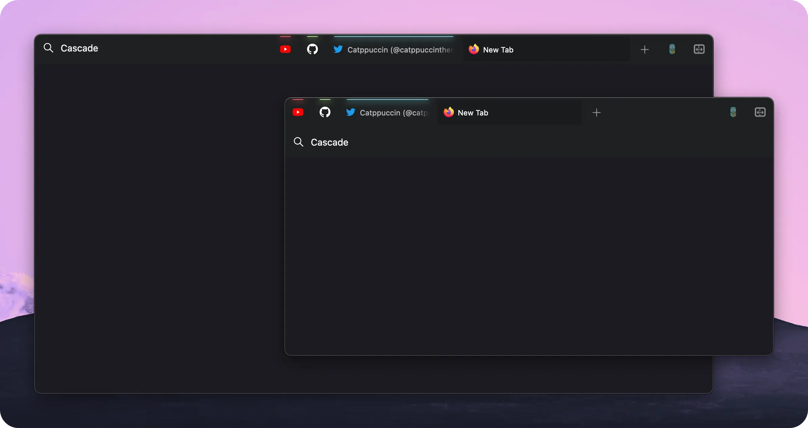
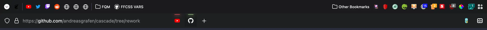
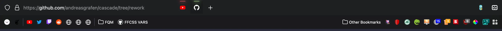
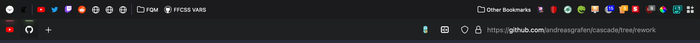
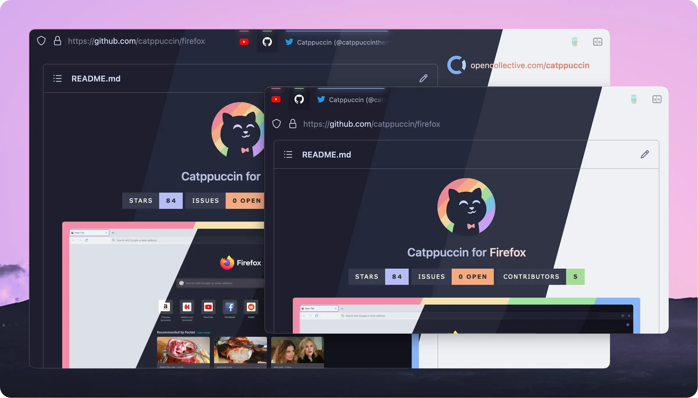
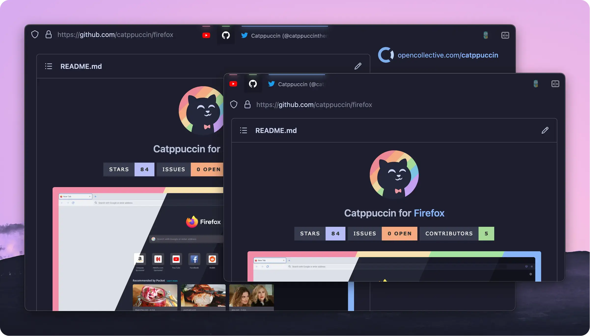
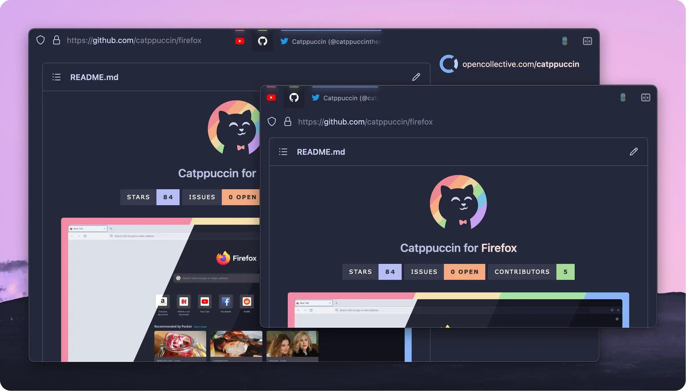
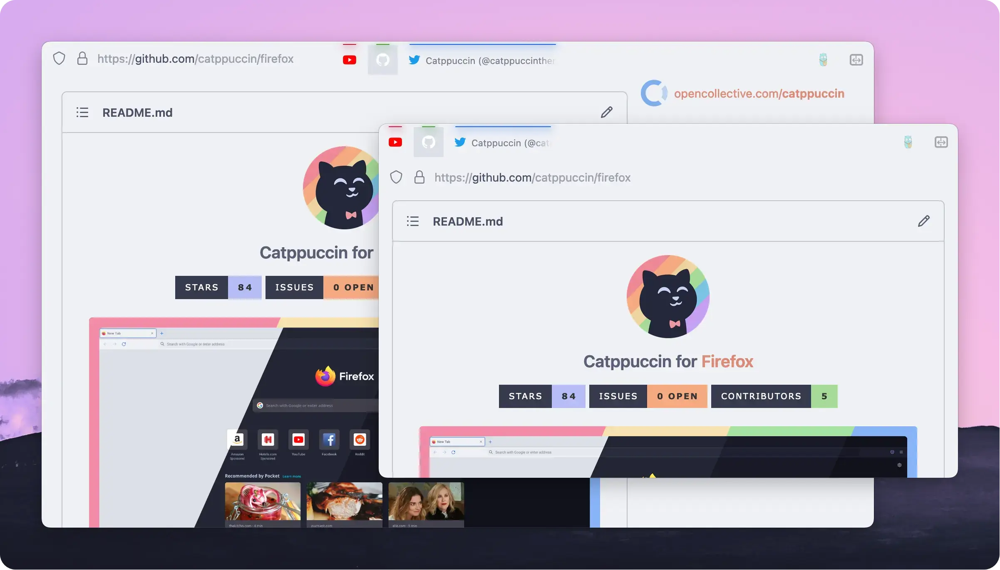
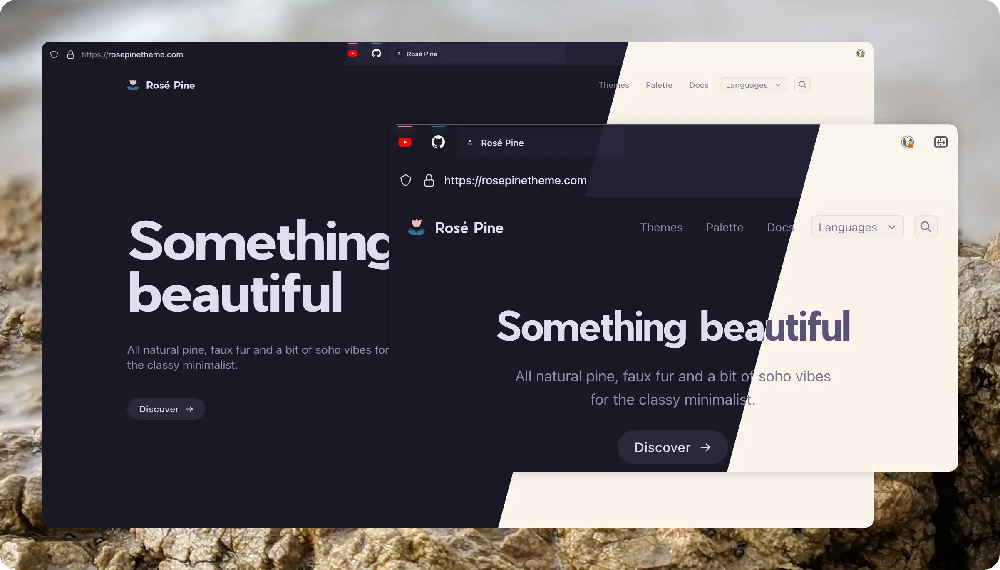
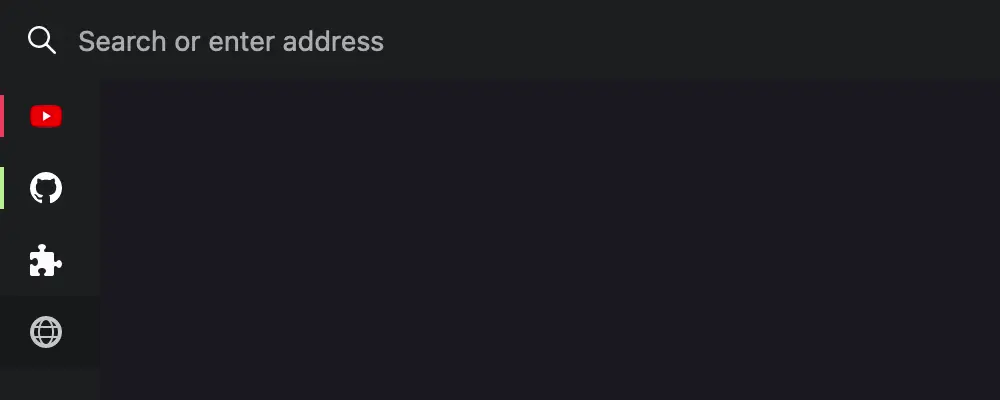

<br><br>

# Cascade
**A minimalistic and keyboard centered userChrome**

Cascade aims to remove a lot of the subjective clutter default Firefox comes with. The theme is also highly inspired by the stylistic choices of [SimpleFox](https://github.com/migueravila/SimpleFox) 🦊 by [Miguel Ávila](https://github.com/migueravila).

**[Installation](#how-to-install-cascade) • [Customisation](#customise-cascade-to-your-liking) • [Integrations](#integrations) • [Keyboard Shortcuts](#keyboard-shortcuts)**

<br>



<br>

This theme was known previously as »*ag.proton*« — but let's be honest: That sounds hella boring. What you get is a really simple adaptive layout that works well with the new Proton UI. By default — on larger screen resolutions – Cascade will transition to a Oneline layout which displays the URL Bar and Tab Bar next to each other. Smaller resultions will stack both UI elements on top of each other for better readability.

<br><br><br>

<div align="center">

[](https://github.com/andreasgrafen/cascade/stargazers)
[](https://github.com/andreasgrafen/cascade/issues)
[](https://discord.gg/jrrw7Eg6sj)

If you *really* like my work you can buy me a coffee to fuel further development.<br>
While appreciated it's ofc by no means necessary. ♡<br><br>
[](https://ko-fi.com/andreasgrafen)

</div>

<br><br><hr><br>

<details><summary><h2>Table of Contents</h2></summary>

- [Installation](#how-to-install-cascade)
- [Customisation](#customise-cascade-to-your-liking)
  - [Colours](#colours)
  - [Mouse Support](#mouse-support)
  - [Reorder the UI](#sort-the-ui-like-you-want-it)
  - [URL Bar Customisation](#url-bar-customisation)
  - [Custom Breakpoint](#oneline-breakpoint)
- [Integrations](#integrations)
  - [Catppuccin](#catppuccin)
  - [Rosé Pine](#rosé-pine)
  - [Vertical Tabs](#tab-center-reborn--vertical-tabs)
  - [Side View](#side-view)
- [Keyboard Shortcuts](#keyboard-shortcuts)

</details><br>

## How to install Cascade

1. Type `about:config` into your URL bar. Click on the **I accept the risk** button if you're shown a warning.
2. Seach for **`toolkit.legacyUserProfileCustomizations.stylesheets`** and set it to **`true`**.
3. Go to your profile folder:
  - Linux: `$HOME/.mozilla/firefox/######.default-release/`
  - MacOS: `Users/[USERNAME]/Library/Application Support/Firefox/Profiles/######.default-release`
  - Windows: `C:\Users\[USERNAME]\AppData\Roaming\Mozilla\Firefox\Profiles\######.default-release`
4. Copy the `chrome` folder into your profile and restart<sup>1)</sup> Firefox.
5. Customise everything to your liking. (*optional*)

<sup>1) If you're running into trouble with a restart seemingly not working you can navigate to `about:profiles` and click the »*Restart Normally*«-Button.</sup>

<br>

> **Note** **⚠️ Attention Windows users**.<br>
It seems like `flexbox` (within the Firefox UI) is inheritly broken on Windows. In order to fix the One-Line layout on windows please substitute the [responsive include](chrome/includes/cascade-responsive.css) with the [version for windows](chrome/includes/cascade-responsive-windows-fix.css). This will ensure that the layout doesn't break **but** since it can't use `flexbox` the UI reordering does **not** work.<br>

<br><br><br>

## Customise Cascade to your liking

> **Note** If you're using Cascade I highly recommend to remove all clutter from the Navigation Bar area. To do so rightclick your bar and go into the customisation settings. You can move all the icons freely which allows you to place your Addons within the Personal Toolbar for example.

<br>

### Colours

By default Cascade loads it's own colours which can be customised to fit your desired by simply changing the [colours include](chrome/includes/cascade-colours.css).
If you want to use Cascade with the Browsers default colours, or custom Firefox Themes like [Firefox Color](https://color.firefox.com) or even Addons like [Adaptive Tab Bar Color](https://github.com/YS-Wong/Adaptive-Tab-Bar-Color) simply remove the [colours include](chrome/includes/cascade-colours.css) from the [userChrome.css](chrome/userChrome.css) file.

> **Note** **Are you having issues with the colours not applying?**<br>
A workaround fix for this issue is to remove the colour include from the [main file](chrome/userChrome.css) and use [Firefox Color](https://addons.mozilla.org/en-GB/firefox/addon/firefox-color/) to apply [this custom theme](https://color.firefox.com/?theme=XQAAAAL8AAAAAAAAAABBKYhm849SCia2CaaEGccwS-xMDPr15o6H0LddKi1zZz7p7H23MOXwiWJCP8Eczt9O0cwm8bbmvpd20uiOFG8WawCZcXzraYdfXj2HrWgd4IgJK7QchIStW1KXpQGYxo9DHahUGJEmoKprdWRKoHPzcBH145YsTnnZq5DK71QEUg2RSwksm6Vs6Y7i7Y-4K-wFjfvAbb__jUJAAA) to apply Cascades default colours.

<br>

### Mouse Support

Cascade offers an [alternative config file](chrome/includes/cascade-config-mouse.css) that reintroduces some of the UI elements that are necessary to use Firefox with a mouse. To use these settings simply substitue the regular config include with the one for mouse support.

This config brings back:
* Navigation Buttons
* the URL Bar Bookmark Button
* the Hamburger Menu
* Tab Close Buttons (on hover)

If the buttons inside the URL Bar are off you may need to change the `--uc-page-action-margin` variable in the config as the necessary margin seems to differ depending on ones setup.

<br>

### Sort the UI like you want it

In the [Cascade config](chrome/includes/cascade-config.css) you can set different ways of how the UI elements are layed out. The URL Bar, Tab Bar and Personal Toolbar can be arranged in different stacks; do you want the Toolbar to be on top or the URL and Tab Bar? Tabs on the left with the URL Bar to the right? No problem!

```css
/*  Position of the Personal Toolbar
 *  possible values:
 *  0 – toolbar on top
 *  4 – toolbar on bottom
 */ --uc-toolbar-position: 0;
```

```css
/*  Position of the URL Bar
 *  possible values:
 *  1 – tabs on the right
 *  3 – tabs on the left
 */ --uc-urlbar-position: 1;
```

<details>
<summary>Previews</summary>





</details><br>

### URL Bar Customisation

You can freely set your desired URL Bar width from within the [config](chrome/includes/cascade-config.css) where the `min-width` setting is the default URL Bar width and `max-width` is the width of the focused URL Bar. Those can be different in order to make more room for the URL Bar when you actually want to use it.

```css
/*  Width of the URL Bar for the Oneline layout
 *  If enabled the max-width is applied on focus
 *  otherwise the URL Bar will always be it's min-width
 */ --uc-urlbar-min-width: 30vw;
    --uc-urlbar-max-width: 45vw;
```

If you set the `min-width` to `0vw` and the `max-width` to `100vw` you can also completely hide the URL Bar as long as it's not focused.


<br>

### Oneline Breakpoint

If you'd like to have Cascade transition into it's Oneline layout on either smaller or larger sizes you can simply do so by changing the breakpoint value in the [responsive include](chrome/includes/cascade-responsive.css) file. If you don't want Cascade to break to the Oneline layout at all remove it from the [userChrome.css](chrome/userChrome.css) file

```css
@media (min-width: 1000px) {

  […]

}
```

<br><br><br>

## Integrations

### Catppuccin



This simply offers premade colour configs for [Catppuccin](https://github.com/catppuccin/catppuccin). There are variants for each dark mode flavour — [Mocha](integrations/catppuccin/cascade-mocha.css), [Macchiato](integrations/catppuccin/cascade-macchiato.css) and [Frappé](integrations/catppuccin/cascade-frappe.css) — all of them come with Latte as their light mode.

<details>
<summary>Individual Previews</summary>






</details>

<br>

### Rosé Pine



Similar to Catppuccin these are premade colour configs for [Rosé Pine](https://github.com/rose-pine/rose-pine-theme). Featuring the [Default Palette](integrations/rose-pine/cascade-rose-pine.css) as well as [Moon](integrations/rose-pine/cascade-moon.css) with Dawn as light mode for both.

<br>

#### How to set it up
1. Copy your desired colour config from [integrations/catppuccin](integrations/catppuccin) or [integrations/rose-pine](integrations/rose-pine) into the [includes](includes) folder
2. Replace the colour include in the [userChrome.css](chrome/userChrome.css) with your desired flavour file

> Alternatively you can also just copy the contents of your desired flavour config into the colour config file.

<br>

### Tab Center Reborn — Vertical Tabs



#### How to set it up
1. Download the [Tab Center Reborn Addon](https://addons.mozilla.org/en-GB/firefox/addon/tabcenter-reborn/)
2. Copy the contents of [integrations/tabcenter-reborn/tabcenter-reborn.css](integrations/tabcenter-reborn/tabcenter-reborn.css) into the Addons settings
3. Import the [integrations/tabcenter-reborn/cascade-tcr.css](integrations/tabcenter-reborn/cascade-tcr.css) into the [userChrome.css](chrome/userChrome.css)

<br>

### Side View

[Mozilla's Side View](https://addons.mozilla.org/en-GB/firefox/addon/side-view/) is an Addon that allows you to open a second Website within the Sidebar of your Browser. Cascades integration gets rid of the header, moves the »*Close*«-Button to the bottom, and allows the sidebar to be up to 50% of your browsers width.

#### How to set it up
1. Download the [Side View Addon](https://addons.mozilla.org/en-GB/firefox/addon/side-view/)
2. Import the [integrations/side-view/cascade-sideview.css](integrations/side-view/cascade-sideview.css) into the [userChrome.css](chrome/userChrome.css)

<br><br><br>

## Keyboard Shortcuts

This userstyle was made for a keyboard centered usage, like Tilling Window Manager users or just cool people that loves them!
These are **some** of the shortcuts that are available:

| Windows / Linux                              | MacOS                            | Description                         |
| -------------------------------------------- | -------------------------------- | ----------------------------------- |
| `Ctrl + L`                                   | `Command + L`                    | focuses the URL bar                 |
| `Ctrl + B`                                   | `Command + B`                    | toggles the bookmark sidebar        |
| `Ctrl + Shift + B`                           | `Command + Shift + B`            | toggles the personal toolbar        |
| `Alt + Left Arrow`                           | `Command + Left Arrow`           | navigates backwards in your history |
| `Alt + Right Arrow`                          | `Command + Right Arrow`          | navigates forwards in your history  |
| `Ctrl + T`                                   | `Command + T`                    | opens a new tab                     |
| `Ctrl + Shift + T`                           | `Command + Shift + T`            | reopens the last closed tab         |
| `Ctrl + W`                                   | `Command + W`                    | closes the current tab              |
| `Ctrl + Page Up`<br/>or `Ctrl + Shift + Tab` | `Command + Option + Left Arrow`  | navigates to the previous tab       |
| `Ctrl + Page Down`<br/>or `Ctrl + Tab`       | `Command + Option + Right Arrow` | navigates to the next tab           |

For the full list of shortcuts visit [the official Firefox website](https://support.mozilla.org/en-US/kb/keyboard-shortcuts-perform-firefox-tasks-quickly).

<br><br>
