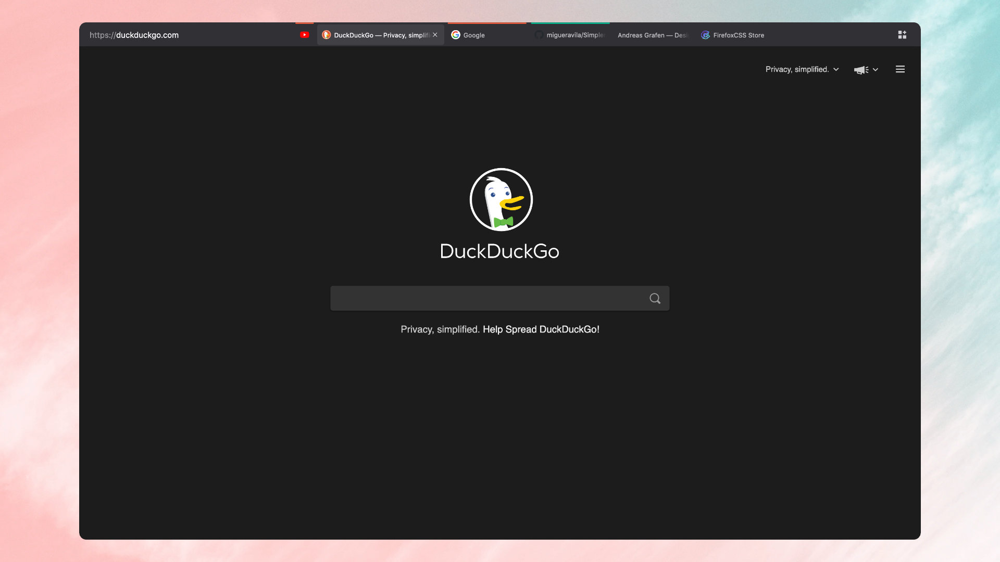

<h1>ag.proton</h1>
<b>Minimalist, Simple, Keyboard Centered and heavily based on SimplerentFox. 🦊</b>

ag.proton is a Firefox Theme based on [SimplerentFox](https://github.com/migueravila/SimplerentFox).
What you get is a really simple one-line layout that works well with the new Proton UI.

Thanks to [Nick](https://github.com/nicksundermeyer) for all the suggestions to improve this theme! ♡

## Usage

> This userstyle was made for a keyboard centered usage, like Tilling Window Manager users or just cool people that loves them! 🤖
> In this section I show you some cool shortcuts you can use with this theme for a better experience

-   `Ctrl + L` focuses the URLBar, which is very useful for quick searches and bookmarks usage
-   `Ctrl + B` shows you the Bookmarks 
-   `Ctrl + H` shows you the History Bar
-   `Ctrl + T` Opens a new Tab
-   `Ctrl + W` Closes a Tab
-   `Ctrl + Shift + T` Re-opens a tab that you just closed
-   `Ctrl + R` Refresh the page you're on
-   `Ctrl + Shift + A` Quick open for Add-Ons
